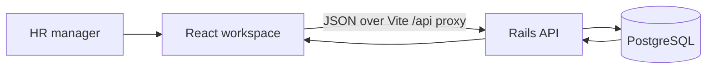

# Architecture and Trade-offs

## Request path

The React client and Rails API are separate applications. The Vite proxy keeps local development same-origin from the browser's perspective; production routing and CORS policy are deployment concerns rather than open CORS.

## Data and API boundaries

- `employees` stores current profile details and annual base salary as `salary_cents` plus an explicit ISO currency code. The first release accepts AUD, CAD, EUR, GBP, SGD, and USD, all with two minor-unit digits.
- PostgreSQL enforces required columns, a case-insensitive unique email index, and indexes common exact filters. Rails validates and normalizes values and returns field-level errors.
- Directory filters, sorting, and bounded pagination run in PostgreSQL. Page size defaults to 20 and is capped at 100; `id` is a stable secondary sort key.
- Search matches name, work email, and job title. At the 10,000-row target, PostgreSQL can evaluate this contains-search without extra extension dependencies. If data volume grows materially, measure it and consider a `pg_trgm` index.
- Dashboard averages and headcounts are grouped in SQL by currency or department. No exchange-rate conversion or cross-currency sum is exposed.
- The seed uses a fixed PRNG seed, fixed timestamps, stable email keys, 1,000-row bulk inserts, and resets the identity sequence. Re-running it replaces the local demo dataset.

## Scale and product trade-offs

10,000 records is modest for PostgreSQL, but it is enough to make loading every salary into a browser the wrong default. Server pagination bounds responses and table rendering; DB-side grouping avoids downloading the whole table for summaries. Filter indexes help the structured queries. The contains-search remains a scan by design at this target size, avoiding an extension that would complicate setup.

The demo edits the current salary in place. Historical compensation, approvals, imports/exports, payroll, and currency conversion are excluded because their retention, jurisdiction, and policy rules need product decisions. The required first-release scope and exclusions are recorded in [REQUIREMENTS.md](../REQUIREMENTS.md).

## Security boundary

The API signs 15-minute HS256 JWTs into an `HttpOnly`, `SameSite=Strict` cookie, with `Secure` enabled in production. Passwords use bcrypt. Public registration creates pending accounts; only a bootstrap administrator can approve or reject requests. Approval is checked on login and every protected API request. The administrator is provisioned from environment secrets during seed or an explicit one-time runner command; registration cannot assign administrator or approved state. A separate CSRF nonce is returned to the client and required on writes, and a token-version check revokes sessions on logout. Login and registration are rate limited. The secret signing key is Rails' `secret_key_base` and must be managed as a production secret.

The cookie is inaccessible to page JavaScript, but the browser owner can still inspect their own cookies and network traffic. This is a local demo authentication boundary, not a complete production identity system; real salary data additionally requires SSO/MFA, least-privilege roles, login throttling, audit trails, key rotation, monitoring, encrypted transport/storage, backups, and privacy-reviewed retention/export controls.